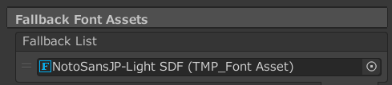
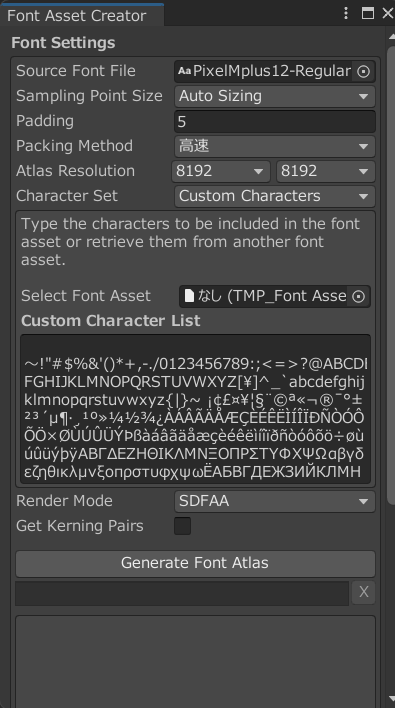

# 初音コネクト(配布用)

## 概要
最大6人協力プレイができる横スクロール2Dシューティングゲームです。

## 特徴
 - TextAliveAPIから取得したデータを使用
   - 歌詞データを取得して弾丸などのテキストに表示する。
   - ビートに合わせて敵が攻撃
   - コードに合わせて色が変化
 - WebRTCを使用
   - サーバーレスでユーザー間の通信
   - 最大6人までの同時協力プレイ
   - 味方の動きを同期
 - Unity WebGLを使用

## オンライン協力プレイ
オンライン協力プレイはHTTPSのみ対応しています。HTTPではソロモードのみ選択可能になっています。
## 対象楽曲
本作は全コンテスト対応曲(6曲)に対応しています。

## 対応環境
  - pc (window pcで検証済み)
  - 一部のアンドロイドスマートフォン(不安定ですが実行は可能です)

## 注意事項
以下の点に注意してください。
 - スマートフォンはメモリ不足やエラーが発生するため非推奨です。
 - WebGL2に対応してないブラウザはエラーが発生します(対応しているかは[こちら](https://webglreport.com/?v=2)をご覧ください)

## デモ動画
https://youtu.be/nMgxDNSPapE

# ビルド
ビルド前に依存関係のUnityEditorとnpmをインストールしてください(UnityはWebGLモジュールを追加でインストールしてください)。

## 必要要件
 - Unity
   - UnityEditor: 2021.3.22f1(WebGL module installed)
   - DOTween(Assetsフォルダーに配置済み)
 - npm
   - typescript: ^4.6.4
   - ts-loader: ^9.3.0
   - webpack: ^5.72.0
   - webpack-cli: ^4.9.2
   - @skyway-sdk/room: ^1.4.0
   - [textalive-app-api](https://developer.textalive.jp/): ^0.3.2

## ビルド
1. Assets/Script/Skyway/Skyway.csのTODOコメントを参考にコードを完成させてください。
2. `npm install`を実行してください。
3. `npm run build`を実行してください。
4. UnityEditorでプロジェクトルートディレクトリを開いてください。
5. Window > TextMeshPro > FontAssetCreator から下記の設定でフォントを作成、もしくはビルド済みフォントをダウンロードしてAssets/Fontフォルダーにコピーしてください。
6. Pixel Mplus 12-Regular SDFのFallback Font AssetsをNotoSansJP-Light SDFに設定してください。

7. すべてのTextMeshPro TextコンポーネントのFontAssetをPixel Mplus 12-Regular SDFに設定してください。
8. WebGLでビルドしてください。

## TextMeshPro FontAssetCreatorの設定

1. Source Font FileをNotoSansJP-Light.otfに設定してください
2. Atlas Resolutionを両方8192に設定してください
3. Character SetをCustom Charactersに設定してください。
4. Custom Character Listにjapanese_full.txtの中身をすべてコピーして貼り付けてください。
5. Generate Font Atlasを押してください
6. Source Font FileをPixelMplus12-Regular.ttfに設定し、同様にフォントを作成してください。

## TextMeshPro ビルド済みフォント
https://drive.google.com/file/d/19SeF4JDF8pdRegOCRV6yHHdlwIB2H08f/view?usp=sharing
https://drive.google.com/file/d/1xtI3w_TcNF3RIHxxN_i8pbi2J1Nto6Yk/view?usp=sharing

配布は予告なしに終了する可能性があります。

## ビルドが成功しない場合
Unity Editorでエラーが発生した場合、もう一度ビルドしてください。(初期ビルドはシェーダーの設定がうまくいかない可能性があります)

## ビルド済みファイル
https://drive.google.com/file/d/1fYFl4HgBr3CKGh0N_-uvjwT39epAHSAW/view?usp=sharing

配布は予告なしに終了する可能性があります。

# 開発メンバー
 - プログラム・プロジェクトマネージャー TangentMochi
 - プログラム・デバック LiquidCatMofu
 - プログラム・デバック buyhard
 - ゲームデザイナー YaeUnsMiracle
 - デザイナー(キャラクター) HappySnow
 - デザイナー(背景) ツダロくん
 - デザイナー(UI) r1pqzelo
 - タイトル音楽・効果音 sankaku785

# ライセンス
LICENSE.md をご参照ください。

Assetsフォルダーすべての画像・音声ファイルの著作権はTeam MOROMENに帰属します。
